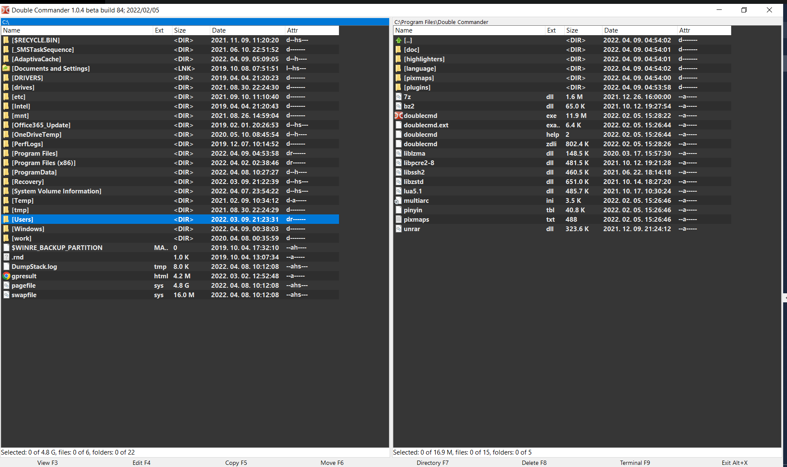

# Themes for Double Commander

Main font is Segoe UI.

To change the theme:

1. Stop Double Commander
2. Override config file `doublecmd.xml` in *~/.config/doublecmd/doublecmd.xml* (or *C:\Users\USER\AppData\Roaming\doublecmd\doublecmd.xml*)

